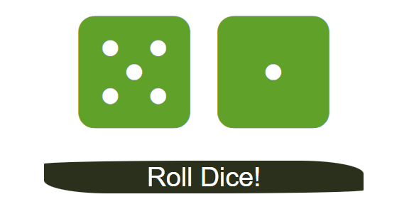

# Dice Exercise

## Description

This exercise is to practice React State by creating a little interactive event that allows you to roll a dice to get a random number between 1-6. The interaction allows for the state of the dice to change to allow for the faces to change numbers at random and to allow for the animation and styling to change with each roll.

## Credit

This exercise was provided by Colt Steele within his Udemy course, Modern React Bootcamp.